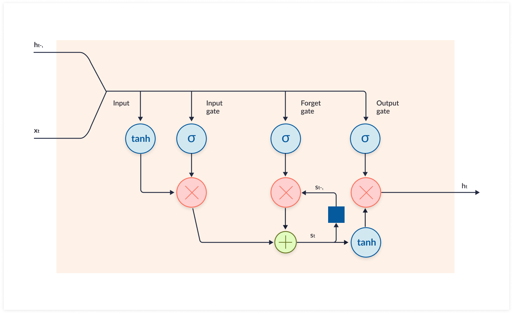

# Stock Analysis

This repo contains some experiments about using LSTM Neural Networks to predict stock trends.

## Introduction
Financial data are easily available and possess a rather turbulent structure which often makes it hard to find reliable patterns. Thus, they are an optimal choice to play with machine learning algorithms, which are capable of finding hidden structures within the data and predict how they will affect them in the future. One method for predicting stock prices is using a long short-term memory neural network (LSTM) for times series forecasting.

## LSTM: A Brief Explanation
Long short-term memory neural network (LSTM) is an improvement of the recurrent neural network (RNN). RNN is an algorithm that helps neural networks deal with the complex problem of analyzing input data that is sequential in nature, i.e. text or speech. In its simplest form, known as "vanilla" RNN, the only difference with the feed-forward neural network is a loop that allows the model to carry forward results from previous neuron layers. This loop generates an hidden state that allows the model to carry over information from previous steps to the current step.  
Due to its characteristics, in an RNN backpropagation needs to take into account that the model is carrying forward information from each neural layer to the next, and fine tune the weights that govern this “short-term memory”. This form of backpropagation is called *Backpropagation Through Time* (BPTT). [1]

While they sound promising, RNNs are rarely used for real-world scenarios because of the *vanishing gradient* problem. In the late 1990s, German researchers [Hochreiter and Schmidhuber](http://www.bioinf.jku.at/publications/older/2604.pdf) proposed the concept of LSTM, which would help an RNN retain information over a longer period of time, not just in between two steps in time. LSTMs are designed to overcome the vanishing gradient problem and allow them to retain information for longer periods compared to traditional RNNs. LSTMs can maintain a constant error, which allows them to continue learning over numerous time-steps and backpropagate through time and layers. [2]

Instead of neurons, LSTM networks have memory blocks that are connected through layers.

A block has components that make it smarter than a classical neuron and a memory for recent sequences. A block contains gates that manage the block’s state and output. A block operates upon an input sequence and each gate within a block uses the sigmoid activation units to control whether they are triggered or not, making the change of state and addition of information flowing through the block conditional.

There are three types of gates within a unit:

- Forget Gate: conditionally decides what information to throw away from the block.
- Input Gate: conditionally decides which values from the input to update the memory state.
- Output Gate: conditionally decides what to output based on input and the memory of the block.

Each unit is like a mini-state machine where the gates of the units have weights that are learned during the training procedure. [3]

### References
1) https://missinglink.ai/guides/neural-network-concepts/recurrent-neural-network-glossary-uses-types-basic-structure/
2) https://missinglink.ai/guides/neural-network-concepts/deep-learning-long-short-term-memory-lstm-networks-remember/
3) https://machinelearningmastery.com/time-series-prediction-lstm-recurrent-neural-networks-python-keras/

##### Environment
Environment setup based on Jupyter minimal image

## Dependencies
* yfinance [https://github.com/scifani/yfinance] - Yahoo! Finance market data downloader
* ta [https://github.com/bukosabino/ta] - Technical Analysis Library
* mplfinance [https://github.com/matplotlib/mplfinance] -  matplotlib utilities for the visualization, and visual analysis, of financial data

