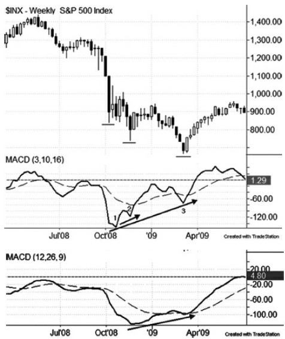
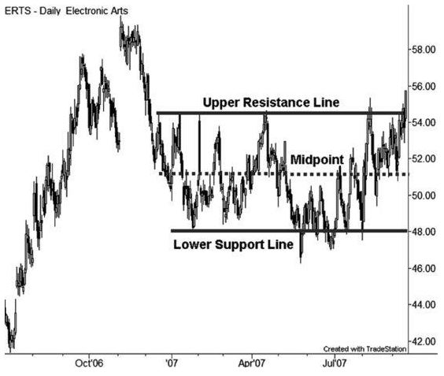
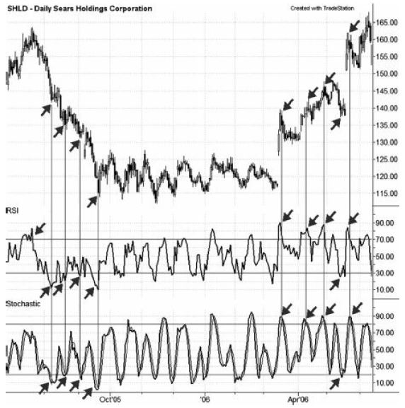
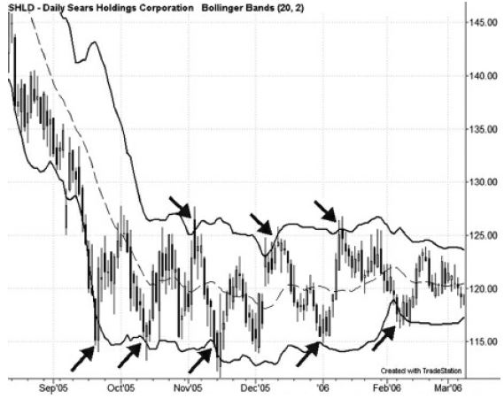
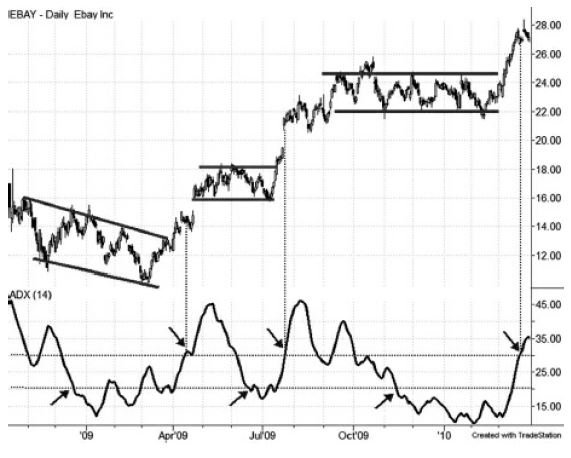
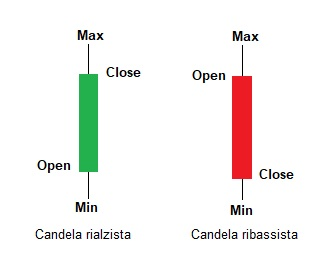
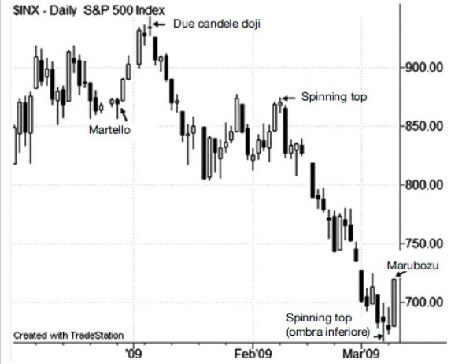

# Guida Completa al Trading - by Corey Rosenbloom
## Trend
Tendenza diffusa, da parte del prezzo di un'azione o di un mercato, di muoversi nella stessa direzione nel corso del tempo.
I trend possono essere di lungo, medio, o breve termine e si dividono in:
-   _ascendente_ = sequenza di massimi / minimi relativi crescenti (_swing rialzista_)
-   _discendente_ = sequenza di massimi / minimi discendenti (_swing ribassista_)
-   _laterale_ = sequenza di massimi / minimi intorno ad una media costante

Una volta consolidato **ha più probabilità di continuare che di invertirsi**. D'altro canto, un trend non può durare per sempre, perchè **l'andamento ciclico del mercanto non si arresta mai**.
L'obiettivo dovrebbe sempre essere l'individuazione della _struttura del trend_ e al contempo di saper cogliere i _segnali di inversione_ di un trend maturo.

### Metodi di definizione del trend
#### Teoria di Dow
Charles Dow notò che per essere valido 
- un trend ascendente doveva avere un massimo superiore e un minimo superiore ed il volume che aumenta nelle fasi di incremento del prezzo e diminuisce nelle fasi di correzione al ribasso
- un trend discendente doveva avere un massimo inferiore e un minimo inferiore ed il volume che aumenta nelle fasi di diminuzione del prezzo e diminuisce nelle fasi di correzione al rialzo
#### Metodo del prezzo puro
Individuare massimi e minimi relativi, confrontando al contempo i massimi e i minimi precedenti con quelli più recenti.
**L'individuazione degli swing**, tuttavia non è banale. Quello che si intende per swing **dipende dall'orizzonte temporale** che si sta analizzando. Su un grafico intraday a 5 minuti uno swing potrebbe durare 30 minuti, su uno giornaliero da settimane a mesi, su uno settimanale da alcuni mesi a un anno.

Nei grafici giornalieri si possono utilizzare i seguenti parametri:

**Variazione % prezzo**
- minore 5% è probabilmente troppo poco
- 5% - 15% è il riferimento più attendibile
- maggiore 15% è probabilmente troppo

**Durata o giorni**
- minore 1 mese è probabilmente troppo poco
- 1-6 mesi è il riferimento più attendibile
- maggiore 6 mesi è probabilmente troppo

##### Inversioni del trend
Il prezzo deve completare un processo specifico perchè si possa dichiarare l'inversione di un trend. Con il metodo del prezzo puro ci sono due modi:

- prezzo, partendo da un massimo (M1), forma un primo minimo inferiore (m1), poi un massimo inferiore (M2 < M1) e poi riscende sotto  m1
- prezzo, partendo da un massimo (M1), forma un massimo inferiore (M2 < M1) e poi scende sotto al minimo precedente. Per un'ulteriore conferma si può attendere la formazione del minimo e di un  nuovo massimo inferiore (M3 < M2)

Il  secondo caso ha un punto di inversione aggressivo ed un secondo più prudente. Questo significa che **la conferma ha sempre un costo**.

#### Metodo della media mobile
Il metodo della media mobile utilizza una media mobile di breve (20 periodi), medio (50 periodi), lungo (200 periodi) termine per valutare la struttura del trend.
Il periodo dipende dal grafico, un giorno su un grafico giornaliero, una settimana su uno settimanale, ecc.
L'**orientamento più rialzista** si ha quando il prezzo è sopra la media di periodo 20, la quale è maggiore di quella di periodo 50, che a sua volta è maggiore di quella di periodo 200.
L'**orientamento più ribassista** si ha invece quando il prezzo è minore della media di periodo 20, la quale è minore di quella di periodo 50, che a sua volta è minore di quella di periodo 200.
Inoltre, gli __incroci delle medie mobili__ fanno presagire delle inversioni del trend ma, come nel caso del metodo del prezzo puro, richiedono una conferma ufficiale dell'inversione.

##### Medie mobili semplici ed esponenziali
La **media mobile semplice** (SMA) attribuisce lo stesso peso a ogni giorno, dando al prezzo di 50 giorni fa la stessa importanza rispetto al prezzo di ieri. La **media mobile esponenziale** (EMA) dà invece maggior rilievo alle barre recenti e meno importanza al passato. Queste tendono perciò a reagire più rapidamente alle variazioni improvvise del prezzo.

##### Inversioni del trend
Utilizzando il metodo della media mobile, perchè un mercato passi da un trend ascendente ad uno discendente su un grafico giornaliero, dovranno verificarsi tutte le seguenti condizioni:
- prezzo deve scendere sotto la MM a 20 giorni e poi sotto la MM a 50 giorni
- la MM a 20 giorni deve incrociare al ribasso la MM a 50 giorni
- il prezzo deve incrociare a ribasso la MM a 200 giorni
- le MM a 20 e 50 giorni devono incrociare a ribasso la MM a 200 giorni
Queste fasi non devono necessariamente essere sequenziali. Inoltre, si rischia di aspettare troppo se si aspetta che il prezzo e le medie di più breve termine scendano al di sotto della MM a 200 periodi.

## Momentum
Il prezzo tende a rimanere stazionario (range-bound), oppure a salire o scendere con un trend stabile finché una forza esterna, che si manifesta sottoforma di squilibrio tra offerta e domanda, non viene a rompere l’equilibrio.
Il **momentum** rappresenta una variazione del prezzo nel corso di un determinato periodo di tempo. Le grandi variazioni (accelerazioni) rappresentano significativi incrementi del momentum ed indicano che il prezzo continuerà a viaggiare nella direzione in cui si verifica l'esplosione del momentum.
Un **gap**, ossia una variazione consistente e improvvisa del prezzo, è per definizione un'esplosione del momentum

Non tutti i gap si traducono in una persistenza del trend. Si distinguono:
- **breakaway gap** si creano all'inizio di un nuovo trend, più o meno al momento di un'inversione confermata del trend
- **runaway** o **measured gap** si creano di solito a metà del trend 
- **exhaustion gap** si creano alla fine di un trend prolungato e vengono colmati immediatamente

##### L'oscillatore Momentum
Mostra la differenza tra il prezzo attuale e quello di X giorni fa, dove X in genere vale 14 giorni.
La figura mostra l'utilizzo dell'indicatore momentum per confrontare gli swing dell'oscillatore e del prezzo (NML = nuovo minimo del momentum, Div = divergenza del momentum)

L'oscillatore dovrebbe comportarsi in maniera simile al prezzo. Se nuovi minimi del prezzo corrispondono a nuovi minimi dell'oscillatore allora ci si può aspettare un ulteriore ribasso del prezzo. In base alla stessa logica, nuovi massimi del prezzo in corrispondenza di nuovi massimi dell'oscillatore lasciano presagire un ulteriore aumento del prezzo.

Mentre il momentum rivela la solidità o debolezza di un trend, le **divergenze** avvertono di una possibile inversione del trend. Una divergenza si verifica quando l'oscillatore e il prezzo sono in disaccordo e mettono in luce un indebolimento del trend e la possibilità di un'inversione futura di esso.
- **divergenza negativa**: nuovo massimo del prezzo ma massimo inferiore dell'oscillatore
- **divergenza positiva**: nuovo minimo del prezzo ma minimo superiore inferiore

L'indicatore momentum conferma un massimo del prezzo quando si forma un nuovo massimo relativo nello stesso momento in cui si forma un nuovo massimo sul prezzo. Ciò indica che il trend è ancora solido.
Le divergenze, invece, inviano il messaggio opposto e segnalano un'attenuazione del trend

##### Indicatore Rate of Change (ROC)
Da le stesse informazioni dell'indicatore momentum ma in termini percentuali:

ROC = [(Chiusura di oggi - Chiusura di N periodi fa)/(Chiusura di N periodi fa)]*100

##### L'oscillatore MACD 3/10
Un altro mezzo per rilevare le caratteristiche del momentum è l'indicatore __Moving Average Convergence Divergence__ (MACD) che rappresenta graficamente la differenza tra due medie mobili. La configurazione di default è 12,26,9: i primi due numeri si riferiscono alle EMA di breve e lungo periodo, ed il terzo è un parametro di smoothing. La differenza tra la media di breve e lungo termine crea la linea MACD, che smussata con il terzo parametro crea la linea del segnale. La configurazione consigliata qui è la **3,10,16**, che è molto più reattiva rispetto all'originale. Impostando l'ultimo parametro a zero si può eliminare la linea del segnale e visualizzare solo la linea MACD.

Quando l'EMA più veloce ha un valore superiore rispetto a quella più lenta, possiamo assumere che il prezzo stia registrando uno swing rialzista.

Come si vede in figura, il MACD 3,10 essendo più reattivo riesce a cogliere le divergenze più velocemente rispetto alla versione standard. La divergenza multipla è un segnale molto forte di probabile inversione del trend. Spesso gli operatori intepretano infatti le divergenze singole come il segnale di raccogliere i profitti, mentre quelle multiple come un segnale di entrata in un trade su inversione.

## Principio di Alternanza del prezzo
Il principio dell'alternanza del prezzo asserisce che il prezzo subisce due fasi alterne, di contrazione e di espansione del range. Tale principio spiega anche perchè alcuni indicatori funzionano bene per un dato periodo di tempo, salvo poi generare una serie di trade perdenti.
- **contrazione del range**: detta anche consolidamento del range, è una fase di compressione laterale che assume la forma di un rettangolo delimitato da trendline orizzontali ben definite, oppure un triangolo con trendline convergenti. E' caratterizzata da bassa volatilità e basso range. Nei grafici si identificano una **linea superiore di resistenza**, nella quale i venditori aprono nuove posizioni allo scoperto in previsione di un calo, una **linea inferiore di supporto**, nella quale gli acquirenti entreranno nel mercato, ed una **linea del valore equo** o punto medio.
Una volta che un determinato livello di prezzo viene "testato" per due volte, spesso conviene tracciare una trendline e prolungarla nel futuro. Fin tanto che il prezzo rimane all'interno di queste trendline orizzontali, i trader possono trarre vantaggio da questi confini.

- **espansione del range**: il prezzo esce dai confini di un range ed entra in una fase di movimento sostenuto al rialzo o al ribasso. Un mercato in espansione continua a espandersi fin quando acquirenti e venditori non raggiungono un nuovo equilibrio del prezzo.Notizie o annunci economici inaspettati rappresentano spesso i **catalizzatori** che spingono il prezzo a uscire dai confini e innescano un movimento di espansione del range a partire da un improvviso squilibrio tra offerta e domanda.

### Feedback Loop
I movimenti dei prezzi delle azioni si verificano principalmente a causa degli squilibri tra domanda e offerta. Questi portano spesso a dei "cicli" o "feedback loop" che possono essere:
- **positivi** caratterizzati da un solido movimento del prezzo in una direzione, di solito quando un mercato sovrasta l'altro, per cui prezzi più elevati comportano prezzi più elevati: i tori acquistano volentieri delle quote e i prezzi maggiori fanno si che gli orsi riacquistino azioni per coprire le loro posizioni. In modo analogo, prezzi più bassi comportano prezzi più bassi: gli orsi vendono volentieri azioni allo scoperto e i prezzi minori fanno si che i tori vendano azioni loro malgrado.
- **negativi** prezzi più elevati comportano prezzi più bassi, i quali comportano prezzi più elevati, nell'ambito di una fase di consolidamento. Un rally del prezzo verso il livello di resistenza fa si che gli orsi vendano volentieri quote allo scoperto in previsione di acquisti futuri, mentre gli acquirenti vendano volentieri per trarre profitti al livello di resistenza. Quando poi il prezzo scende a un livello inferiore i venditori allo scoperto riacquistano volentieri e i tori acquistano volentieri in previsione di un rally futuro.

### Scelta degli indicatori
Tra i più popolari indicatori di trading alcuni funzionano bene in fasi di espansione, altri in fase di consolidamento. Tra quelli che funzionano bene nelle fasi di espansione ci sono le **medie mobili**, mentre particolarmente efficaci nelle fasi di contrazione sono gli oscillatori dell'ipercomprato/ipervenduto come lo Stochastic o il Relative Strength Index (RSI).

#### Indicatori in fase di espansione

Uno degli indicatori che funziona straordinariamente bene nei movimenti di espansione del range è rappresentato dalle medie mobili, utili soprattutto a definire quale è il trend, come visto nel [metodo della media mobile](#metodo-della-media-mobile).

#### Indicatori in fase di contrazione

L'**indicatore stocastico** ha la seguente formula:

K = 100 * ((_CC_ - _LL_) / (_HH_ - _LL_))

dove _**CC**_ = chiusura corrente, _**LL**_ = lowest low in X periodi, _**HH**_ = highest high in X periodi.

L'**indicatore RSI** ha la seguente formula:

RSI = 100 * (_U_ / (_U_ + _D_))

dove _**U**_ è la media delle differenze di chiusura al rialzo di X periodi e _**D**_ è la media del valore assoluto delle differenze di chiusura al ribasso di X periodi.

_Per entrambi gli indicatori il numero di periodi consigliato pari a 14 ed entrambi sono "range-bound", ovvero variano all'interno di un range compreso tra 0 e 100. Sono identificabili delle soglie superiori di ipercomprato ed inferiori di ipervenduto. Per lo stocastico tali soglie sono 20 - 80, per l'RSI 30 - 70._

Come si può vedere dalla figura 3.9 gli indicatori stocastico e RSI funzionano bene all'interno di un range consolidato (feedback negativo), ma se utilizzati in fase di espansione generano numerosi segnali "difettosi".

L'**indicatore Bollinger Bands** prende in considerazione gli ultimi 20 periodi e traccia il prezzo medio, corrispondente alla SMA di periodo 20, a partire dal quale calcola la deviazione standard. Infatti, in una distribuzione Normale il 95% delle osservazioni sono collocate entro due deviazioni standard della media. E' per questo che tale indicatore funziona bene nelle fasi di contrazione in cui il prezzo oscilla attorno ad un valore medio di riferimento.
Tuttavia, una volta che il prezzo esce dalla stabilità del trading range per entrare in un feedback loop negativo, comincia a rimanere al di fuori di una delle due bande, superiore o inferiore, in base alla direzione del trend.

L'**indicatore ADX** (_Average Directional Index_) può risultare di grande aiuto nell'individuare l'entità della fase di feedback nella quale una particolare azione o mercato si trova. Esso calcola la forza di un trend in atto o ne rivela l'assenza ed è la media di due segnali: l'indicatore direzionale positivo che misura la forza di prezzi in salita e l'indicatore direzionale negativo che misura la forza di prezzi in discesa.

In presenza di un importante movimento al rialzo l'indice direzionale positivo sale mentre quello negativo scende, facendo aumentare la media dei due e generando il valore dell'ADX. Tale valore assume i seguenti significati:
- _maggiore di 30_:  il prezzo ha sviluppato una fase di espansione del range
- _tra 20 e 30_: potenziale fase di transizione
- _minore di 20_: assenza di un trend
- _minore di 15_: periodo prolungato di contrazione del range

Pertanto l'ADX non rivela la direzione di un movimento ma piuttosto l'intensità.

## Grafici a candele

I grafici a candele forniscono segnali più chiari e informazioni supplementari in corrispondenza di importanti inversioni del mercato, in particolare:
- rivelano rapidamente variazioni nel rapporto tra domanda e offerta
- permettono di individuare facilmente i punti di inversione del prezzo
- confermano altri segnali quando il prezzo si sposta in un'area di supporto o resistenza
- consentono di entrare in una posizione in modo oggettivo, quando il prezzo sale sopra o scende sotto una candela di inversione
- rivelano informazioni relative a orizzonti temporali più brevi

Oltre alla distanza tra apertura e chiusura, la distanza tra le cosiddette ombre o stoppini riflettono la volatilità. Ombre superiori lunghe riflettono un rifiuto del prezzo nel continuare la salita e rappresenta un segnale ribassista, importante quando si produce in corrispondenza di un livello di resistenza che contiene anche una divergenza negativa del momentum o altri segnali di vendita provenienti da altri indicatori.

Dal grafico di fig. 4.3 si possono individuare alcuni specifici segnali a candele in corrispondenza dei principali punti di inversione. La differenza tra prezzo di apertura e prezzo di chiusura fornisce indizi sulla relazione tra domanda e offerta: un prezzo che ha chiuso nettamente al di sopra di quello di apertura indica una forza rialzista e viceversa, uno che ha chiuso nettamente sotto al prezzo di apertura indica una debolezza ribassista. Un prezzo che si mantiene stabile tra apertura e chiusura indica neutralità tra domanda e offerta. Particolarmente importante è il range di una barra rispetto alle precedenti, per fare osservazioni sulla volatilità della candela. Le candele con range ristretto (bassa volatilità) possono riflettere un mercato che potenzialmente può invertirsi. Candele solide e di grandi dimensioni possono indicare che si sta sviluppando un movimento di espansione o di inversione del trend.

#### Candele estreme: Marubozu

La candela rialzista nella quale l'apertura corrisponde al minimo e la chiusura al massimo prende il nome di _marubozu rialzista_. Questa candela indica che gli acquirenti hanno prevalso sui venditori, che potrebbe segnalare l'inizio di un movimento rialzista. Il suo opposto è la _marubozu ribassista_, nella quale l'apertura corrisponde al massimo e la chiusura al minimo.

Le candele estreme segnalano che le probabilità favoriscono la continuazione nella direzione della chiusura della candela sulla base del principio che è più probabile che un trend persista che non che si inverta.

Esiste tuttavia una formazione a candela simile al marubozu che funge da segnale di inversione: si tratta delle _bullish engulfing_ e _bearish engulfing_. Il corpo di una candela engulfing supera quello della precedente ed in alcuni casi ne supera anche massimo e minimo. Queste candele si associano ad un mercato che ha registrato un'improvvisa variazione dello squilibrio tra domanda e offerta e possono indicare l'esatto punto di inversione del prezzo.
