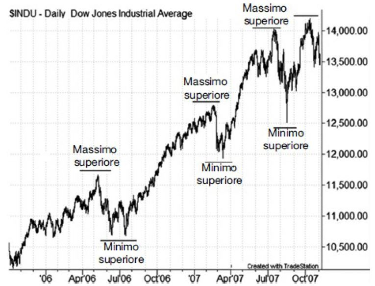
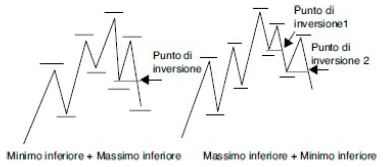
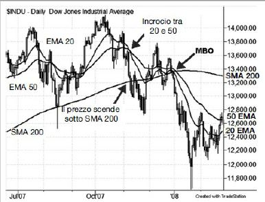
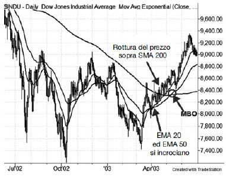
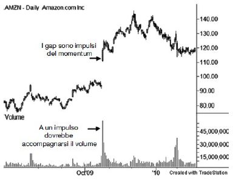
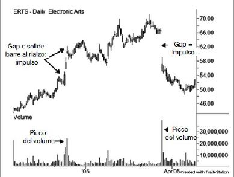
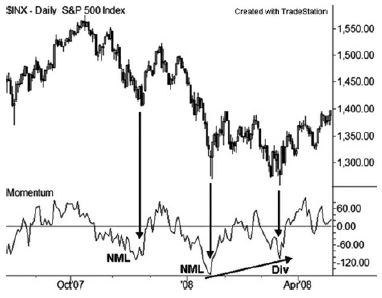

# Guida Completa al Trading - by Corey Rosenbloom
## Trend
Tendenza diffusa, da parte del prezzo di un'azione o di un mercato, di muoversi nella stessa direzione nel corso del tempo.
I trend possono essere di lungo, medio, o breve termine e si dividono in:
-   _ascendente_ = sequenza di massimi / minimi relativi crescenti (_swing rialzista_)
-   _discendente_ = sequenza di massimi / minimi discendenti (_swing ribassista_)

Una volta consolidato **ha più probabilità di continuare che di invertirsi**. D'altro canto, un trend non può durare per sempre, perchè **l'andamento ciclico del mercanto non si arresta mai**.
L'obiettivo dovrebbe sempre essere l'individuazione della _struttura del trend_ e al contempo di saper cogliere i _segnali di inversione_ di un trend maturo.

### Metodi di definizione del trend
#### Teoria di Dow
Charles Dow notò che per essere valido 
- un trend ascendente doveva avere un massimo superiore e un minimo superiore ed il volume che aumenta nelle fasi di incremento del prezzo e diminuisce nelle fasi di correzione al ribasso
- un trend discendente doveva avere un massimo inferiore e un minimo inferiore ed il volume che aumenta nelle fasi di diminuzione del prezzo e diminuisce nelle fasi di correzione al rialzo
#### Metodo del prezzo puro
Individuare massimi e minimi relativi, confrontando al contempo i massimi e i minimi precedenti con quelli più recenti.
**L'individuazione degli swing**, tuttavia non è banale. Quello che si intende per swing **dipende dall'orizzonte temporale** che si sta analizzando. Su un grafico intraday a 5 minuti uno swing potrebbe durare 30 minuti, su uno giornaliero da settimane a mesi, su uno settimanale da alcuni mesi a un anno.

Nei grafici giornalieri si possono utilizzare i seguenti parametri:

**Variazione % prezzo**
- minore 5% è probabilmente troppo poco
- 5% - 15% è il riferimento più attendibile
- maggiore 15% è probabilmente troppo

**Durata o giorni**
- minore 1 mese è probabilmente troppo poco
- 1-6 mesi è il riferimento più attendibile
- maggiore 6 mesi è probabilmente troppo

##### Inversioni del trend
Il prezzo deve completare un processo specifico perchè si possa dichiarare l'inversione di un trend. Con il metodo del prezzo puro ci sono due modi:

- prezzo, partendo da un massimo (M1), forma un primo minimo inferiore (m1), poi un massimo inferiore (M2 < M1) e poi riscende sotto  m1
- prezzo, partendo da un massimo (M1), forma un massimo inferiore (M2 < M1) e poi scende sotto al minimo precedente. Per un'ulteriore conferma si può attendere la formazione del minimo e di un  nuovo massimo inferiore (M3 < M2)

Il  secondo caso ha un punto di inversione aggressivo ed un secondo più prudente. Questo significa che **la conferma ha sempre un costo**.

#### Metodo della media mobile
Il metodo della media mobile utilizza una media mobile di breve (20 periodi), medio (50 periodi), lungo (200 periodi) termine per valutare la struttura del trend.
Il periodo dipende dal grafico, un giorno su un grafico giornaliero, una settimana su uno settimanale, ecc.
L'**orientamento più rialzista** si ha quando il prezzo è sopra la media di periodo 20, la quale è maggiore di quella di periodo 50, che a sua volta è maggiore di quella di periodo 200.
L'**orientamento più ribassista** si ha invece quando il prezzo è minore della media di periodo 20, la quale è minore di quella di periodo 50, che a sua volta è minore di quella di periodo 200.
Inoltre, gli __incroci delle medie mobili__ fanno presagire delle inversioni del trend ma, come nel caso del metodo del prezzo puro, richiedono una conferma ufficiale dell'inversione.

##### Medie mobili semplici ed esponenziali
La **media mobile semplice** (SMA) attribuisce lo stesso peso a ogni giorno, dando al prezzo di 50 giorni fa la stessa importanza rispetto al prezzo di ieri. La **media mobile esponenziale** (EMA) dà invece maggior rilievo alle barre recenti e meno importanza al passato. Queste tendono perciò a reagire più rapidamente alle variazioni improvvise del prezzo.

##### Inversioni del trend
Utilizzando il metodo della media mobile, perchè un mercato passi da un trend ascendente ad uno discendente su un grafico giornaliero, dovranno verificarsi tutte le seguenti condizioni:
- prezzo deve scendere sotto la MM a 20 giorni e poi sotto la MM a 50 giorni
- la MM a 20 giorni deve incrociare al ribasso la MM a 50 giorni
- il prezzo deve incrociare a ribasso la MM a 200 giorni
- le MM a 20 e 50 giorni devono incrociare a ribasso la MM a 200 giorni
Queste fasi non devono necessariamente essere sequenziali. Inoltre, si rischia di aspettare troppo se si aspetta che il prezzo e le medie di più breve termine scendano al di sotto della MM a 200 periodi.

## Momentum
Il prezzo tende a rimanere stazionario (range-bound), oppure a salire o scendere con un trend stabile finché una forza esterna, che si manifesta sottoforma di squilibrio tra offerta e domanda, non viene a rompere l’equilibrio.
Il **momentum** rappresenta una variazione del prezzo nel corso di un determinato periodo di tempo. Le grandi variazioni (accelerazioni) rappresentano significativi incrementi del momentum ed indicano che il prezzo continuerà a viaggiare nella direzione in cui si verifica l'esplosione del momentum.
Un **gap**, ossia una variazione consistente e improvvisa del prezzo, è per definizione un'esplosione del momentum

Non tutti i gap si traducono in una persistenza del trend. Si distinguono:
- **breakaway gap** si creano all'inizio di un nuovo trend, più o meno al momento di un'inversione confermata del trend
- **runaway** o **measured gap** si creano di solito a metà del trend 
- **exhaustion gap** si creano alla fine di un trend prolungato e vengono colmati immediatamente

##### L'oscillatore Momentum
Mostra la differenza tra il prezzo attuale e quello di X giorni fa, dove X in genere vale 14 giorni.
La figura mostra l'utilizzo dell'indicatore momentum per confrontare gli swing dell'oscillatore e del prezzo (NML = nuovo minimo del momentum, Div = divergenza del momentum)

L'oscillatore dovrebbe comportarsi in maniera simile al prezzo. Se nuovi minimi del prezzo corrispondono a nuovi minimi dell'oscillatore allora ci si può aspettare un ulteriore ribasso del prezzo. In base alla stessa logica, nuovi massimi del prezzo in corrispondenza di nuovi massimi dell'oscillatore lasciano presagire un ulteriore aumento del prezzo.

Mentre il momentum rivela la solidità o debolezza di un trend, le **divergenze** avvertono di una possibile inversione del trend. Una divergenza si verifica quando l'oscillatore e il prezzo sono in disaccordo e mettono in luce un indebolimento del trend e la possibilità di un'inversione futura di esso.
- **divergenza negativa**: nuovo massimo del prezzo ma massimo inferiore dell'oscillatore
- **divergenza positiva**: nuovo minimo del prezzo ma minimo superiore inferiore

L'indicatore momentum conferma un massimo del prezzo quando si forma un nuovo massimo relativo nello stesso momento in cui si forma un nuovo massimo sul prezzo. Ciò indica che il trend è ancora solido.
Le divergenze, invece, inviano il messaggio opposto e segnalano un'attenuazione del trend

##### Indicatore Rate of Change (ROC)
Da le stesse informazioni dell'indicatore momentum ma in termini percentuali:

ROC = [(Chiusura di oggi - Chiusura di N periodi fa)/(Chiusura di N periodi fa)]*100

##### L'oscillatore MACD 3/10
Un altro mezzo per rilevare le caratteristiche del momentum è l'indicatore __Moving Average Convergence Divergence__ (MACD) che rappresenta graficamente la differenza tra due medie mobili. La configurazione di default è 12,26,9: i primi due numeri si riferiscono alle EMA di breve e lungo periodo, ed il terzo è un parametro di smoothing. La differenza tra la media di breve e lungo termine crea la linea MACD, che smussata con il terzo parametro crea la linea del segnale. La configurazione consigliata qui è la **3,10,0**, che è molto più reattiva rispetto all'originale.

Quando l'EMA più veloce ha un valore superiore rispetto a quella più lenta, possiamo assumere che il prezzo stia registrando uno swing rialzista.
